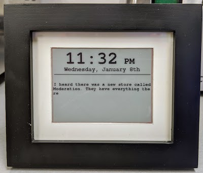

# esp8266-epaper-frame
EPaper Display project using ESP8266 Driver

This repository hosts code for a basic e-paper display embedded in a photo frame.

## Inspiration

This project was primarily inspired by 
- [Epaper ShowerThoughts (youtube)](https://www.youtube.com/watch?v=NFej0Jlwgxk) ([github](https://github.com/acrobotic/Ai_Demos_ESP8266/tree/master/epd_showerthoughts))

## Hardware
- Waveshare 4.2" Epaper Display (https://www.amazon.com/dp/B07DMV5K2Z)
- The amazing [ESP8266 SoC](http://esp8266.net) from [Espressif](https://www.espressif.com/en/products/hardware/esp-wroom-02/overview) - _Included as a driver board when you buy the above_
- 4x5" Photo frame (https://www.amazon.com/dp/B07BRCC5P9)
- Standoffs and screws (https://www.amazon.com/dp/B07D7828LC)

The youtube video for the ShowerThoughts project has very good instructions on how the display is assembled in the photo frame

## Firmware
The firmware for the ESP8266 Driver was implemented with the Arduino IDE. The following external libraries were used 
- [Arduino Core for ESP8266](https://github.com/esp8266/Arduino)
- [EzTime for Arduino](https://github.com/ropg/ezTime)
- [GxEPD2 - Display Library for SPI E-Paper Displays](https://github.com/ZinggJM/GxEPD2)
   - Requires [Adafruit GFX](https://github.com/adafruit/Adafruit-GFX-Library)

_TODO_: Adding [ESP8266 WifiConnection Manager](https://github.com/tzapu/WiFiManager) to better handle WiFi Connections causes low free heap and prevents the HTTPS Client from working. Need to investigate why or look for an alternative that uses less memory

## Change the Wifi Configuration
- See the section on [Updating Firmware](#updating-firmware) to setup your Arduino environment. 
- Load up the Arduino Project in this repo in the IDE
- At the very top of the file update the value for the variables `ssid` and `password`
- Burn the firmware to the board.

## Updating Firmware
The following resources will help you get setup with the Arduino IDE and ESP8266
- [Getting Started with the Arduino IDE](https://www.arduino.cc/en/Guide/HomePage)
- [Install Arduino Core for ESP9266](https://github.com/esp8266/Arduino#installing-with-boards-manager)
- [Install Libraries in Arduino IDE](https://www.arduino.cc/en/Guide/Libraries)

Connect the ESP8266 Driver board to your workstation using a micro-usb cable and choose the "Generic ESP8266 Module" from the list of available boards. Choose the right port to communicate with the board. In Linux/OSX this is typically `/dev/ttyUSB0` or similar. In Windows, this will be something like `COM3` or `COM4`. Load the Arduino project file from this repo in your IDE and "burn" it to the board.

## Other Interesting Projects To Try
- [ESP8266 EPD Weather & Google Calendar](https://github.com/doctormord/ESP8266_EPD_Weather_Google_Calendar)
- [ThingPulse Weather Station](https://github.com/ThingPulse/espaper-weatherstation)
